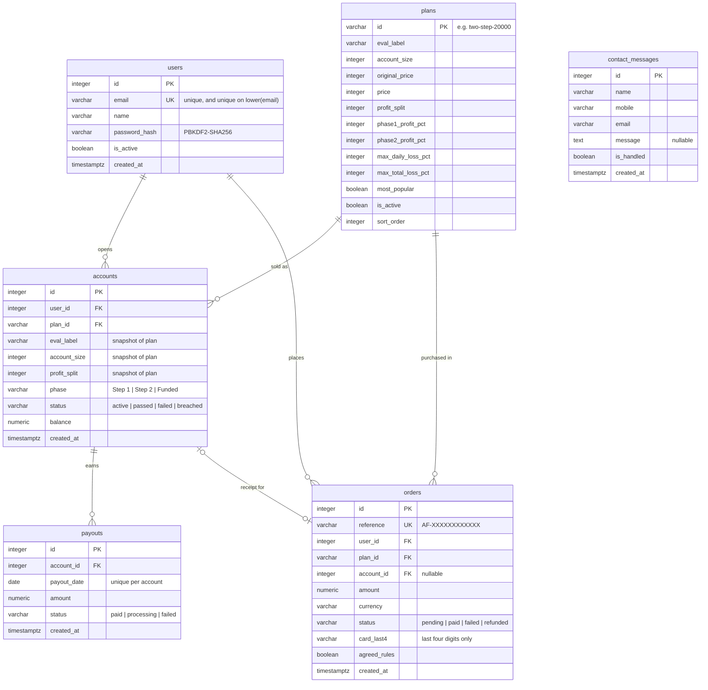

# ApexFund — PostgreSQL Schema

Versioned SQL for the database behind [`backend_jitendra`](../backend_jitendra).
Everything the API needs — tables, constraints, indexes, views, seed plans and
least-privilege roles — is defined here rather than being created implicitly by
the ORM, so the deployed schema is reviewable in a diff.

Every script is idempotent. Re-running `apply.sh` is the intended way to pick up
changes, not something to avoid.

## Quick start

### With Docker

```bash
cd database_postgres
cp .env.example .env
docker compose up -d          # applies sql/001..005 on first boot
```

### Against an existing Postgres

```bash
cd database_postgres
cp .env.example .env          # edit DATABASE_URL to point at your server
./scripts/apply.sh --create-db
```

Add `--with-demo` to load a demo trader with a funded account and payout
history. Then point the backend at it:

```bash
export DATABASE_URL="postgresql+psycopg://apexfund:<password>@127.0.0.1:5432/apexfund"
export AUTO_CREATE_TABLES=false
cd ../backend_jitendra && uvicorn app.main:app --reload
```

`AUTO_CREATE_TABLES=false` is the important part: it stops the application
creating tables behind your back, so this SQL stays the single source of truth.
The backend defaults it to `false` for any non-SQLite `DATABASE_URL` already, but
setting it explicitly documents the intent.

## Files

| File | Purpose |
| --- | --- |
| `sql/001_tables.sql` | The six tables, with their check constraints and foreign keys |
| `sql/002_indexes.sql` | Every index, including the case-insensitive email guard |
| `sql/003_views.sql` | Reporting views (`vw_account_overview`, `vw_platform_stats`, `vw_daily_sales`) |
| `sql/004_seed_plans.sql` | Upserts the three challenge plans |
| `sql/005_roles_grants.sql` | `apexfund_app`, `apexfund_readonly`, `apexfund_migrator` and their grants |
| `sql/optional_demo_data.sql` | Demo trader, account, payouts, order — **not** applied by default |
| `sql/verify.sql` | Read-only check that every expected object exists; fails loudly if not |
| `sql/drop_all.sql` | Destructive teardown of all ApexFund objects |
| `scripts/apply.sh` | Applies 001–005 in order, then verifies |
| `scripts/reset.sh` | Drops everything and rebuilds; requires `--yes` |
| `docker-compose.yml` | Local Postgres 18, bound to loopback |
| `Makefile` | `make up / apply / demo / verify / psql / reset / dump` |

## Schema



### Where the data comes from

| Table | Replaces | Written by |
| --- | --- | --- |
| `users` | `apexfund_users` in localStorage | `POST /api/auth/signup` |
| `plans` | The `PLANS` array in `js/data.js` | `sql/004_seed_plans.sql`, plus an idempotent upsert on API startup |
| `accounts` | `apexfund_accounts` in localStorage | `POST /api/checkout` |
| `orders` | Nothing — there was no record of a purchase | `POST /api/checkout` |
| `payouts` | A hard-coded array in `js/dashboard.js` | `POST /api/checkout` |
| `contact_messages` | `contactMessages` in localStorage | `POST /api/contact` |

## Design decisions worth knowing

**Plan terms are copied onto each account.** `accounts` duplicates
`eval_label`, `account_size` and `profit_split` from `plans`. That is deliberate
denormalisation: an account must keep the terms it was sold under even if the
plan is later repriced or withdrawn, and a foreign key alone cannot express
that.

**Emails are unique twice.** `ix_users_email` covers the exact string, and
`uq_users_email_lower` covers `lower(email)`. The API compares emails
case-insensitively, and its "does this email exist?" check is a separate
statement from the insert — so under concurrency only the database can actually
decide the race. `POST /api/auth/signup` catches the resulting integrity error
and returns 409.

**No card data is storable.** `orders` has `card_last4 varchar(4)` constrained
to four digits and no column for a PAN, expiry or CVC. The absence is the point:
there is nowhere for that data to be written even by mistake.

**Check constraints encode the business rules**, not just types:
`price <= original_price` (the pricing table renders one struck through the
other), `max_daily_loss_pct <= max_total_loss_pct` (a daily cap above the total
cap could never bind), and `status <> 'paid' OR agreed_rules` (checkout gates the
pay button on the rules checkbox, so a paid order must carry the
acknowledgement).

**The application never connects as the schema owner.** `apexfund_app` gets DML
only, no DDL. `apexfund_migrator` owns the schema. `apexfund_readonly` is for
analytics. Roles are created without passwords so no default credential is
committed here; a password-less role cannot log in under `scram-sha-256`, so set
one before use:

```sql
ALTER ROLE apexfund_app PASSWORD 'a-strong-generated-secret';
```

**Identity columns, not `serial`.** `GENERATED BY DEFAULT AS IDENTITY` is the
SQL-standard form and keeps sequence ownership tied to the column, while still
allowing explicit ids for seed data.

## Keeping this in step with the ORM

`backend_jitendra/app/models.py` and these scripts describe the same schema, and
nothing enforces that automatically. Table, column, constraint and index names
here match exactly what SQLAlchemy's `create_all()` would emit, so the two
cannot drift silently — a mismatch shows up as a real error rather than a
duplicate object.

To compare what is deployed against what the models expect:

```bash
make dump > /tmp/deployed.sql        # schema-only pg_dump
```

**There is no migration tool wired up.** These scripts are additive and
idempotent, which is enough for a schema that only ever grows. The moment you
need to change or drop an existing column on a database with data you care
about, add Alembic to `backend_jitendra` and generate migrations from the models
instead of hand-editing `001_tables.sql`. The check constraints defined here are
stricter than the ORM's column types, so autogenerate will not reproduce them —
keep them in a migration of their own.

Two things the models do not have and this schema deliberately does not add:
`updated_at` columns and soft-delete flags. Adding them to SQL alone would break
parity; add them to `models.py` first.

## Operational notes

```bash
make verify                  # confirm every expected object exists
make psql                    # interactive shell
make dump                    # schema-only dump for review
make reset                   # DESTRUCTIVE rebuild, local only
```

`reset.sh` refuses to run against a target whose name contains `prod`,
`production` or `live` unless `ALLOW_PRODUCTION_RESET=1` is set.

Backups are not configured here. Before this holds anything real, set up
`pg_dump` on a schedule plus point-in-time recovery, and test a restore — an
untested backup is not a backup.

The Docker init directory only runs when the data volume is empty, so
`docker compose up` against an existing volume applies nothing. Use
`./scripts/apply.sh` for changes, or `docker compose down -v` to start clean.
